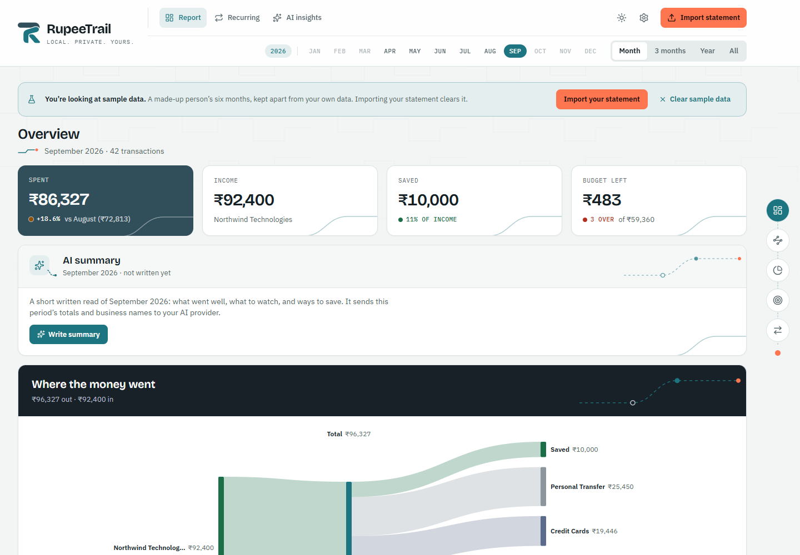
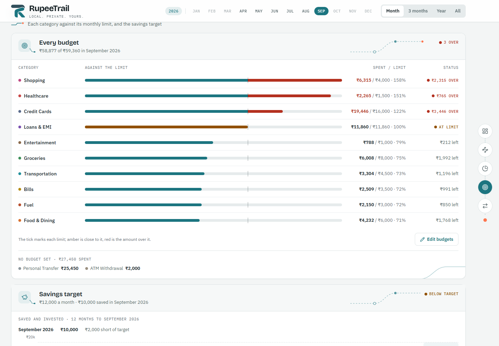
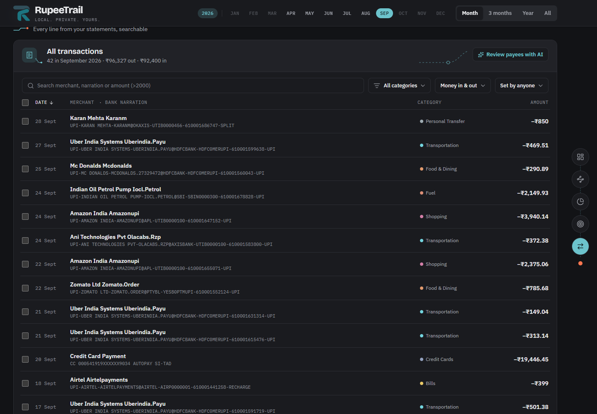

<p align="center">
  <picture>
    <source media="(prefers-color-scheme: dark)" srcset="frontend/public/logo-on-dark.svg">
    
  </picture>
</p>

<h1 align="center">RupeeTrail</h1>

<h3 align="center">Local. Private. Yours.</h3>

<p align="center">See where your money went, from your own bank statement, on your own computer.</p>

<p align="center">
Most expense apps in India read your SMS, ask for access to your account,<br>
or upload your transactions to their servers, and many charge a subscription.
</p>

<p align="center">
RupeeTrail reads the statement your bank already gives you, makes sense<br>
of Indian UPI and NEFT lines, and keeps everything on your computer.
</p>

<p align="center"><b>Free and open source.</b></p>

<p align="center">
  
</p>

RupeeTrail reads the statement you download from your bank and turns it into a report: what came in, what went out, where it went, how your budgets are doing and what repeats every month. It cleans up the cryptic lines banks print (`UPI-MC DONALDS-MCDONALDS.4117…@HDFCBANK-…`) into names you recognise and sorts them into categories.

It runs on your computer. There's no account, no sign-in and no server: your statements and transactions never leave your machine. AI is optional and only runs when you press a button, with your own key.

> **Bank support:** RupeeTrail reads **HDFC Bank** statements (PDF and Excel) and **Google Pay** statements (PDF). More banks are planned; see [adding a bank](docs/adding-a-bank.md).

## What it does

- **Import a statement** (PDF or Excel from HDFC NetBanking, or a Google Pay statement). Re-importing overlapping months is safe: duplicates are skipped. A payment in both your bank statement and your GPay statement is counted once. A GPay statement on its own gives a report of your UPI payments only: salary, card payments and auto-debits aren't in it. The file is deleted once its transactions are saved, unless you choose to keep a copy.
- **One report per period** (a month, 3 months, a year or everything): money in and out, where it went, cash flow over time, what changed since last time, budgets, savings and every transaction.
- **Categories that learn.** Rules sort most payments; change one and RupeeTrail remembers that payee next time. UPI payments to people are kept apart from businesses.
- **Budgets** per category and a monthly savings target, with what's over, near or under.
- **Recurring payments**: subscriptions, EMIs, SIPs and bills, and what's coming up next.
- **Optional AI, your own key** (DeepSeek, OpenAI, Anthropic, or Ollama running on your computer): a written summary of the period with ways to save, and a review of payee names and categories. Every AI screen shows exactly what gets sent before you send it.
- **Light and dark**, and it works on a phone-sized window.

<p align="center">
  
  
</p>

## Get started

You need **Python 3.10 to 3.13** ([python.org](https://www.python.org/downloads/); on Windows, tick "Add Python to PATH" while installing).

1. Download the latest release from the [Releases page](https://github.com/Abhishek-J-Sudo/rupeetrail/releases) and unzip it.
2. Start it:
   - **Windows:** double-click `start.bat`.
   - **Mac:** double-click `start.command` (the first time, right-click → Open).
   - **Linux:** run `python3 start.py` in the folder.
3. Your browser opens RupeeTrail at http://localhost:5175. The first start takes a few minutes while it installs what it needs; after that it starts in seconds.

Not ready to use your own statement? Click **Try with sample data** on the welcome screen to look around with six months of a made-up person's account. Importing a real statement clears it.

To stop RupeeTrail, close the window it runs in (or press Ctrl+C there).

### Getting your statement from HDFC

In HDFC NetBanking, open your account statement, pick the months you want and download it as **Excel** or **PDF**. It works with the statement as the bank gives it, not with scanned or photographed pages.

## Your data

- Everything is saved in the `data` folder inside the RupeeTrail folder. Settings shows the exact path, and `RUPEETRAIL_DATA_DIR` in `backend/.env` can move it.
- Nothing is collected: no analytics, no tracking, no accounts. RupeeTrail only talks to the internet if you turn on AI, and only when you press an AI button.
- To remove everything, delete the `data` folder.

Read [PRIVACY.md](PRIVACY.md) for exactly what the AI features send.

## Run from the source code

For development, or to run the latest code. You need Python 3.10–3.13 and [Node.js](https://nodejs.org) 20.19 or newer.

```sh
git clone https://github.com/Abhishek-J-Sudo/rupeetrail.git
cd rupeetrail
python start.py          # builds the screens, then runs like a release
python start.py --dev    # for development: live-reloading screens (5175) and API (8000)
```

On Windows, `dev.bat` does the same as `--dev`. Tests (once `--dev` has installed the developer tools): `cd backend && venv/Scripts/python -m pytest` (`venv/bin/python` on Mac and Linux).

How it's built: a Python app (FastAPI, pdfplumber, pandas, SQLite) reads statements and stores transactions; the screens are React (Vite, Tailwind, Recharts). Both run on your computer, and `start.py` serves them together on `127.0.0.1` only.

## Contributing

Bug reports and pull requests are welcome, especially readers for other banks: see [docs/adding-a-bank.md](docs/adding-a-bank.md). **Never attach or commit a real statement**, not even with parts blanked out; make a fake one in the same layout instead.

## Disclaimer

RupeeTrail sorts and totals what's in your statement. It isn't financial advice, and the AI can be wrong. Check totals against your bank statement. RupeeTrail is not affiliated with HDFC Bank or any other bank.

## Licence

[MIT](LICENSE)
